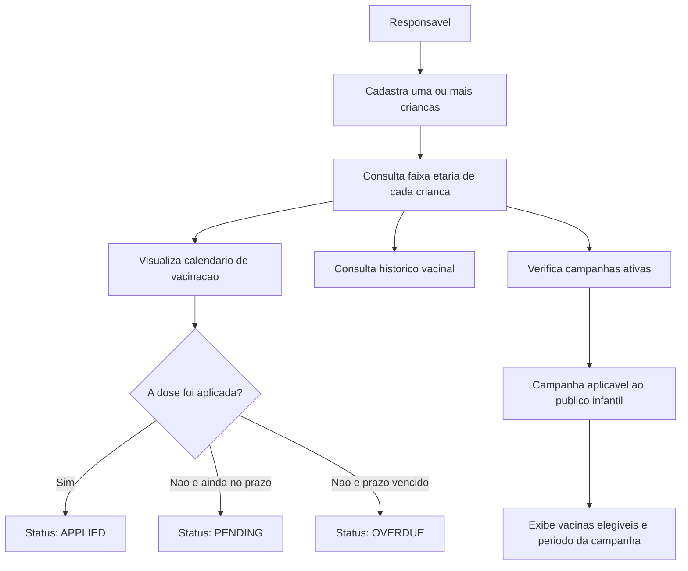
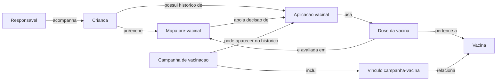

# Diagrama Visual do Modelo de Negocio

Este diagrama resume a estrutura de negocio do sistema de vacinacao infantil, com foco em relacionamento entre responsavel, criancas, vacinas, doses, campanhas e aplicacoes.

## Fluxo Principal de Uso

## Visao Estrutural do Dominio

## Leitura do Diagrama

- Um `Responsavel` pode acompanhar varias `Crianca`.
- Cada `Crianca` pode ter varios registros no `Mapa pre-vacinal`.
- Cada `Crianca` possui varias `Aplicacao vacinal` ao longo do tempo.
- O `Mapa pre-vacinal` apoia a decisao de aplicar ou adiar a dose.
- Cada `Aplicacao vacinal` usa uma `Dose da vacina`.
- Cada `Dose da vacina` pertence a uma `Vacina`.
- Uma `Campanha de vacinacao` pode incluir varias vacinas por meio do `Vinculo campanha-vacina`.
- Uma aplicacao pode, opcionalmente, estar ligada a uma campanha.

## Regras que o diagrama cobre

- Vacina aplicada: `APPLIED`.
- Vacina ainda no prazo: `PENDING`.
- Vacina com prazo vencido: `OVERDUE`.
- Mapa pre-vacinal liberado: `CLEAR`.
- Mapa pre-vacinal com alerta: `ATTENTION`.
- Mapa pre-vacinal bloqueado: `BLOCKED`.
- Campanha ativa: periodo atual entre `start_date` e `end_date`.

## Uso na entrega

Este documento pode ser renderizado diretamente no GitHub e serve como base visual da solucao antes da implementacao das telas.
