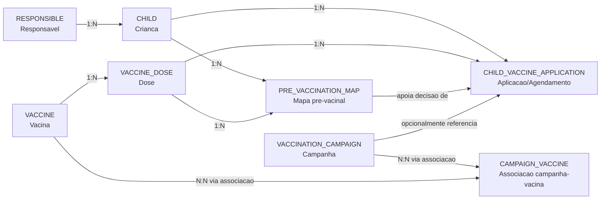
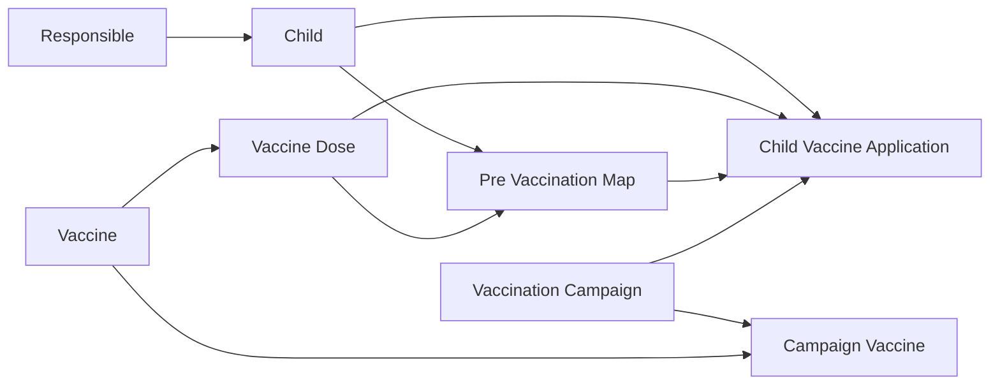

# Modelagem de Dados (3FN) e Decisao SQL vs NoSQL

## Contexto

O dominio principal deste desafio envolve dados relacionais com dependencias claras:
- responsavel -> crianca;
- crianca -> historico de aplicacoes;
- vacina -> doses;
- triagem pre-vacinal -> elegibilidade da aplicacao;
- campanhas -> vacinas/publico alvo.

A necessidade de rastrear historico, pendencias e atrasos exige consistencia de dados e consultas previsiveis.

## SQL ou NoSQL?

### Resumo da decisao

Para este problema, a recomendacao principal e **SQL relacional** como fonte de verdade do dominio vacinal.

### Justificativa tecnica

1. O problema e fortemente relacional (joins naturais entre crianca, dose, aplicacao e campanha).
2. Integridade referencial reduz inconsistencias (FK, UNIQUE, CHECK).
3. Regras de negocio ficam mais auditaveis (historico, atraso, pendencia).
4. 3FN facilita evolucao e manutencao sem redundancia.

### E quando NoSQL faria sentido?

NoSQL (ex.: Firestore) pode ser usado como camada de leitura/sincronizacao mobile ou para publicacao rapida, mas com cuidado para nao duplicar logica critica de consistencia.

### Decisao para este desafio

- **Modelo canonicamente desenhado em SQL (3FN)**.
- Aplicacao Ionic pode iniciar com dados mockados via services.
- Em evolucao futura, opcao de integrar Firestore como diferencial, mantendo regras criticas centralizadas.

## Visao Geral da Estrutura

## Modelo Logico em 3FN

### 1) RESPONSIBLE
Representa o responsavel legal ou cuidador principal.

| Tupla | Tipo | Chave | Regra | Descricao |
| --- | --- | --- | --- | --- |
| id | uuid | PK | obrigatorio | Identificador unico do responsavel |
| full_name | varchar(120) | - | obrigatorio | Nome completo do responsavel |
| email | varchar(120) | UK | opcional | E-mail para contato e autenticacao futura |
| phone | varchar(30) | - | opcional | Telefone principal |
| created_at | timestamptz | - | obrigatorio | Data de cadastro |

### 2) CHILD
Representa cada crianca vinculada a um responsavel.

| Tupla | Tipo | Chave | Regra | Descricao |
| --- | --- | --- | --- | --- |
| id | uuid | PK | obrigatorio | Identificador unico da crianca |
| responsible_id | uuid | FK | obrigatorio | Vinculo com o responsavel |
| full_name | varchar(120) | - | obrigatorio | Nome da crianca |
| birth_date | date | - | obrigatorio | Data de nascimento usada para calcular faixa etaria |
| created_at | timestamptz | - | obrigatorio | Data de cadastro |

### 3) VACCINE
Representa o catalogo das vacinas.

| Tupla | Tipo | Chave | Regra | Descricao |
| --- | --- | --- | --- | --- |
| id | uuid | PK | obrigatorio | Identificador unico da vacina |
| name | varchar(120) | UK | obrigatorio | Nome da vacina |
| disease | varchar(120) | - | obrigatorio | Doenca/previsao imunologica associada |
| notes | text | - | opcional | Observacoes clinicas ou operacionais |
| active | boolean | - | obrigatorio | Indica se a vacina continua ativa no catalogo |

### 4) VACCINE_DOSE
Representa cada dose recomendada de uma vacina.

| Tupla | Tipo | Chave | Regra | Descricao |
| --- | --- | --- | --- | --- |
| id | uuid | PK | obrigatorio | Identificador unico da dose |
| vaccine_id | uuid | FK | obrigatorio | Vinculo com a vacina base |
| dose_number | int | UK parcial | obrigatorio | Numero sequencial da dose |
| min_age_months | int | - | obrigatorio | Idade minima recomendada em meses |
| recommended_until_months | int | - | opcional | Idade limite ideal para aplicacao |
| min_interval_days | int | - | opcional | Intervalo minimo entre doses |

Restricao logica: `UNIQUE (vaccine_id, dose_number)` para impedir duas doses iguais na mesma vacina.

### 5) VACCINATION_CAMPAIGN
Representa campanhas ativas ou passadas.

| Tupla | Tipo | Chave | Regra | Descricao |
| --- | --- | --- | --- | --- |
| id | uuid | PK | obrigatorio | Identificador unico da campanha |
| title | varchar(160) | - | obrigatorio | Titulo da campanha |
| description | text | - | opcional | Texto descritivo |
| start_date | date | - | obrigatorio | Inicio da campanha |
| end_date | date | - | obrigatorio | Fim da campanha |
| target_min_age_months | int | - | opcional | Faixa etaria minima do publico alvo |
| target_max_age_months | int | - | opcional | Faixa etaria maxima do publico alvo |

### 6) CAMPAIGN_VACCINE
Tabela de associacao N:N entre campanhas e vacinas.

| Tupla | Tipo | Chave | Regra | Descricao |
| --- | --- | --- | --- | --- |
| campaign_id | uuid | PK, FK | obrigatorio | Referencia para a campanha |
| vaccine_id | uuid | PK, FK | obrigatorio | Referencia para a vacina |

Esta tabela evita redundancia e permite reutilizar a mesma vacina em mais de uma campanha.

### 7) CHILD_VACCINE_APPLICATION
Representa cada previsao ou aplicacao de dose em uma crianca.

| Tupla | Tipo | Chave | Regra | Descricao |
| --- | --- | --- | --- | --- |
| id | uuid | PK | obrigatorio | Identificador unico do registro |
| child_id | uuid | FK | obrigatorio | Crianca que recebe a dose |
| vaccine_dose_id | uuid | FK | obrigatorio | Dose planejada ou aplicada |
| scheduled_date | date | - | obrigatorio | Data prevista para a dose |
| applied_date | date | - | opcional | Data efetiva da aplicacao |
| status | varchar(20) | - | obrigatorio | Estado da aplicacao: `PENDING`, `APPLIED`, `OVERDUE` |
| batch_number | varchar(50) | - | opcional | Lote da vacina |
| health_unit | varchar(120) | - | opcional | Unidade onde foi aplicado |
| pre_vaccination_map_id | uuid | FK opcional | opcional | Referencia para triagem pre-vacinal usada na decisao |
| campaign_id | uuid | FK opcional | opcional | Relacao opcional com campanha |

Restricoes recomendadas:
- `CHECK` para garantir coerencia entre `status` e `applied_date`.
- `UNIQUE (child_id, vaccine_dose_id)` para evitar duplicidade do mesmo agendamento por crianca.

### 8) PRE_VACCINATION_MAP
Representa o mapa de pre-vacinas (triagem clinica rapida antes da aplicacao).

| Tupla | Tipo | Chave | Regra | Descricao |
| --- | --- | --- | --- | --- |
| id | uuid | PK | obrigatorio | Identificador unico da triagem |
| child_id | uuid | FK | obrigatorio | Crianca avaliada |
| vaccine_dose_id | uuid | FK | obrigatorio | Dose em analise na triagem |
| filled_at | timestamptz | - | obrigatorio | Data/hora de preenchimento |
| had_fever | boolean | - | obrigatorio | Indicador de febre recente |
| has_flu_symptoms | boolean | - | obrigatorio | Indicador de sintomas gripais |
| has_allergy_history | boolean | - | obrigatorio | Indicador de historico alergico relevante |
| is_using_medication | boolean | - | obrigatorio | Indicador de uso atual de medicacao que exija analise |
| had_recent_hospitalization | boolean | - | obrigatorio | Indicador de internacao recente |
| observations | text | - | opcional | Observacoes livres da triagem |
| recommendation | varchar(20) | - | obrigatorio | Resultado da triagem: `CLEAR`, `ATTENTION`, `BLOCKED` |
| recommended_by | varchar(120) | - | opcional | Nome do profissional ou origem da recomendacao |

## Diagrama de Dependencias Funcionais

## Validacao de Formas Normais

### 1FN
- Atributos atomicos; sem listas em colunas.

### 2FN
- Tabelas com PK simples ou, quando composta, sem dependencia parcial de atributo nao-chave.

### 3FN
- Sem dependencias transitivas entre atributos nao-chave.
- Exemplo: dados da vacina ficam em VACCINE; dose em VACCINE_DOSE; aplicacao em CHILD_VACCINE_APPLICATION.

## Regras de Negocio Derivadas

1. `OVERDUE`: data prevista menor que hoje e `applied_date` nula.
2. `PENDING`: data prevista maior/igual hoje e `applied_date` nula.
3. `APPLIED`: `applied_date` preenchida.
4. Campanha ativa: hoje entre `start_date` e `end_date`.
5. Se o mapa pre-vacinal indicar `BLOCKED`, a dose nao deve ser aplicada ate nova avaliacao.
6. Se o mapa indicar `ATTENTION`, a aplicacao exige confirmacao adicional e registro de observacao.
7. Se o mapa indicar `CLEAR`, a dose segue fluxo normal de aplicacao.

## Impacto direto nos cenarios do desafio

1. Cenarios 1 e 2: atendidos por `CHILD_VACCINE_APPLICATION.status` + datas.
2. Cenario 3: atendido por `VACCINATION_CAMPAIGN` + campanhas ativas.
3. Cenario 4: atendido por segregacao por `child_id` e relacao com `responsible_id`.
4. Mapa pre-vacinal: atendido por `PRE_VACCINATION_MAP` vinculado a `CHILD`, `VACCINE_DOSE` e opcionalmente a `CHILD_VACCINE_APPLICATION`.

## Observacao de implementacao (fase frontend)

Mesmo sem backend nesta fase, o frontend pode seguir exatamente este contrato com interfaces TypeScript e mocks. Isso evita retrabalho ao conectar API/Firestore depois.
